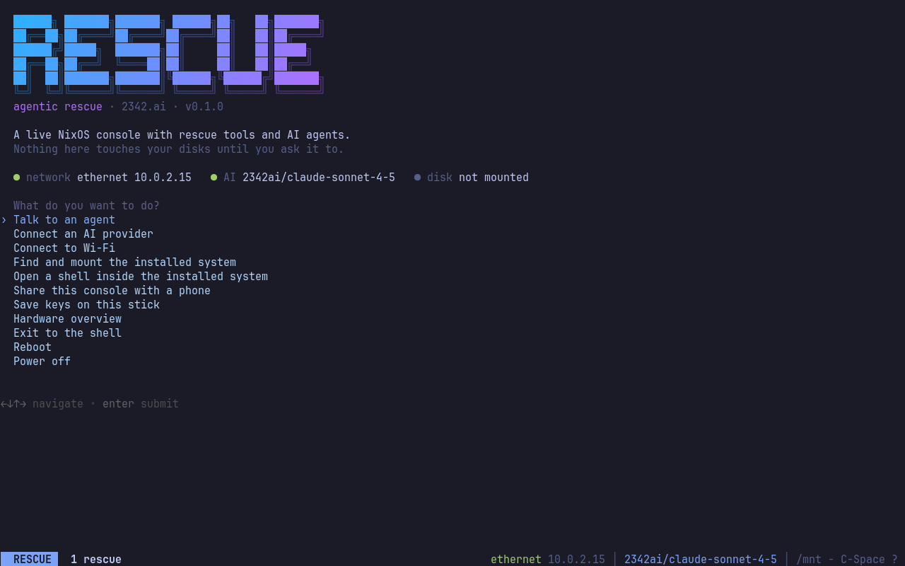

<p align="center">
  
</p>

<h1 align="center">Agentic Rescue</h1>

<p align="center">
  Ein NixOS-Live-Rettungssystem mit <b>opencode</b>, <b>Claude Code</b> und <b>Codex</b> an Bord.<br>
  Ein Key, drei Agenten, kein Login beim Booten. Konfiguriert im Browser, während die ISO herunterlädt.
</p>

<p align="center">
  <a href="README.md">English</a> ·
  <a href="https://rescue.2342.ai">Download</a> ·
  <a href="#selbst-bauen">Selbst bauen</a> ·
  <a href="#der-konfigurations-slot">Konfigurations-Slot</a> ·
  <a href="https://2342.ai">2342.ai</a> ·
  <a href="https://anycast.io">anycast.io</a>
</p>

---

Der Laptop bootet nicht mehr. Du steckst einen Stick ein, und dreißig Sekunden später liest ein Agent, der weiß, wie LUKS, Btrfs, ZFS, systemd-boot und pacman zusammenhängen, mit dir `dmesg` und das Journal des installierten Systems. Er hängt erst nur lesend ein, sagt dir, was er gefunden hat, und fragt, bevor er etwas ändert.

Das ist Agentic Rescue. SystemRescue mit Verstand, gebaut aus einem einzigen Nix-Flake.

## Was drin ist

- **Eine Konsole, die gut aussieht.** kmscon auf tty1 mit JetBrains Mono, Truecolor und Tokyo-Night-Palette, darunter tmux, darüber ein `gum`-Menü. Ein zweiter Booteintrag mit `nomodeset` für schwierige GPUs.
- **Drei Agenten.** `opencode`, `claude` und `codex` sind installiert und vorkonfiguriert. Sie lesen `/etc/agentic-rescue/AGENTS.md`: wo sie sind, wie NixOS-, Arch-, Debian-, Fedora- und Windows-Installationen von außen aussehen, und die Regeln. Erst nur lesend diagnostizieren, nichts Destruktives ohne gezeigten Befehl und ausdrückliches Ja, Backup vor jeder Änderung.
- **Ein Key für alle drei.** [2342.ai](https://2342.ai) spricht die OpenAI-kompatible API, die Responses API und die Anthropic Messages API. Ein einziger Key versorgt opencode, Codex und Claude Code, mit sichtbarem Datenpfad und einem Budget. Groq, Google AI Studio, OpenRouter und OpenCode Zen funktionieren ebenfalls und haben kostenlose Kontingente. Anthropic- und OpenAI-Keys gehen direkt.
- **Konfiguriert, bevor es je gebootet hat.** Die ISO enthält einen 16-KiB-Konfigurations-Slot. Die [Download-Seite](https://rescue.2342.ai) schreibt Key, WLAN, SSH-Key und Tastaturlayout *im Browser* hinein, während das Image auf deine Platte streamt. Kein Server sieht den Key, kein Image wird pro Nutzer neu gebaut.
- **Oder konfiguriert an der Konsole.** Kein Key im Slot? `C-Space k` zeigt einen QR-Code. Das Handy öffnet eine Einmal-Seite im lokalen Netz und trägt den Key ein. Claude- und Codex-Abonnenten melden sich genauso an: `C-Space u` reicht den Anmeldelink ans Handy und holt den Code zurück.
- **Echte Dateisystem-Unterstützung.** ZFS, Btrfs, XFS, ext4, NTFS, exFAT, F2FS, LUKS, LVM, mdadm. `rescue-mount` findet das installierte System, entsperrt es, hängt es mit den richtigen Subvolumes nur lesend unter `/mnt` ein, und `rescue-enter` wechselt mit `nixos-enter` oder `arch-chroot` hinein.
- **Funktioniert offline.** Die Variante `offline` bringt ein lokales 4B-Modell mit (Qwen3-4B-Instruct, Q4), das llama.cpp ausliefert. Langsam, aber es liest Logs und ruft Werkzeuge ohne Netz.
- **Das Handy als zweiter Bildschirm.** `rescue-share` liefert die Konsole per ttyd ins LAN; Tailscale ist installiert, falls das LAN nicht reicht.
- **Reproduzierbar.** `nix build .#iso` liefert dasselbe Image, das die Download-Seite ausliefert, nur ohne deinen Key. Alles sind NixOS-Module, die du in deine eigene ISO importieren kannst.

## Schnellstart

1. Auf [rescue.2342.ai](https://rescue.2342.ai) Anbieter wählen, Key einfügen, herunterladen.
2. Datei auf einen Stick schreiben: `dd if=agentic-rescue-*.iso of=/dev/sdX bs=4M status=progress oflag=sync`, oder mit Etcher oder Ventoy.
3. Booten. Du landest im Menü. `rescue-mount`, dann `opencode`.

Ohne Download-Seite:

```sh
nix build github:2342-ai/agentic-rescue#iso
nix run github:2342-ai/agentic-rescue#patch -- result/iso/*.iso \
  --provider groq --key gsk_... --wifi "Zuhause" "passwort" --keymap de -o mein-rescue.iso
```

## An der Konsole

Der Stick bootet direkt hierhin: Status von Netz, KI-Anbieter und Platte, darunter ein Menü. Wer das Menü verlässt, bekommt die Befehlsübersicht; `C-Space m` holt das Menü als Popup zurück.

<p align="center"></p>

Mit einem Key im Slot starten die Agenten ohne Anmeldung und ohne Vertrauensabfrage. `/root` und `/mnt` sind für Claude Code und Codex vorab freigegeben, und opencode nutzt dieselben Tokyo-Night-Farben wie die Konsole.

| Befehl | Was er tut |
|---|---|
| `rescue` | Das Menü. Auch `C-Space m` in tmux. |
| `rescue-mount [--rw]` | LUKS entsperren, LVM/mdadm zusammensetzen, ZFS importieren, Root finden, unter `/mnt` einhängen. Nur lesend, außer mit `--rw`. `--unmount` macht alles rückgängig. |
| `rescue-enter [-- befehl]` | `nixos-enter` für NixOS-Roots, `arch-chroot` für alles andere. |
| `rescue-connect` | Key tippen, vom Handy eingeben oder die Anmeldung eines Agenten starten. |
| `rescue-handoff link` | Den letzten Link auf dem Bildschirm als QR-Code ans Handy schicken; das Handy kann einen Code zurückgeben. `C-Space u`. |
| `rescue-share` | Die tmux-Sitzung im Handy-Browser (ttyd, URL mit Zufalls-Token). `C-Space s`. |
| `rescue-persist` | Eine beschreibbare Partition `RESCUE_DATA` hinter der ISO auf dem Stick anlegen. Dort gespeicherte Keys überleben Neustarts. |
| `rescue-status` | Netz, Anbieter, Modell, Mount-Zustand. Auch die tmux-Statuszeile. |
| `rescue-config show` | Die zusammengeführte Konfiguration mit maskierten Geheimnissen. |
| `impala` | WLAN. `C-Space w`. |

tmux-Prefix ist `C-Space`. `C-Space ?` zeigt die Tasten.

## Der Konfigurations-Slot

`/rescue-config.json` im ISO-Root ist eine 16-KiB-Datei: kompaktes JSON, gefolgt von Leerzeichen. ISO9660 speichert Dateien zusammenhängend, deshalb lassen sich die Bytes an Ort und Stelle ersetzen, ohne etwas anderes anzufassen. Das Image bleibt gleich groß, die hybride GPT bleibt gültig, und die Datei überlebt dd, Etcher, Ventoy und Rufus gleichermaßen. Beim Booten ist sie `/iso/rescue-config.json`.

Alle Felder sind optional außer `v` und `slot`. Der `slot`-Marker ist das, woran die Patch-Werkzeuge den Offset ohne Sidecar-Datei erkennen; lass ihn drin. Das vollständige Format steht in [`examples/rescue-config.example.json`](examples/rescue-config.example.json) und in der [englischen README](README.md#the-configuration-slot).

Beim Booten werden drei Quellen zusammengeführt, spätere gewinnen: der ISO-Slot, `/persist/rescue-config.json` auf einer `RESCUE_DATA`-Partition und zur Laufzeit eingegebene Werte. `rescue-config apply` schreibt daraus die Umgebungsvariablen der Anbieter, `opencode.json` mit Modell, eigenen Providern und Berechtigungsregeln, die Claude-Code-Einstellungen (`ANTHROPIC_BASE_URL` und Token für 2342.ai), die Codex-`config.toml` (Responses-Endpunkt von 2342.ai oder OpenAI direkt), die iwd-WLAN-Dateien, `authorized_keys` und das Tastaturlayout für kmscon.

Welcher Agent welchen Anbieter nimmt: Claude Code bevorzugt einen Anthropic-Key, dann 2342.ai. Codex bevorzugt einen OpenAI-Key, dann 2342.ai. opencode nimmt das Feld `model`, sonst das Standardmodell des ersten konfigurierten Anbieters.

### Ein Image patchen

```sh
nix run github:2342-ai/agentic-rescue#patch -- rescue.iso --provider groq --key gsk_... -o out.iso
nix run github:2342-ai/agentic-rescue#patch -- rescue.iso --config meine-config.json   # an Ort und Stelle
nix run github:2342-ai/agentic-rescue#patch -- rescue.iso --extract                    # zurücklesen
nix run github:2342-ai/agentic-rescue#patch -- rescue.iso --locate                     # Offset als JSON
```

`release.json` entsteht mit `nix build .#release` neben jeder ISO und wird von CI veröffentlicht. Es enthält Version, Dateiname, Größe, SHA-256, `configOffset` und `configLength`.

## Die Download-Seite

`web/` ist eine statische Seite ohne Framework. Sie lädt `release-<variante>.json`, streamt die ISO durch einen `TransformStream`, der am veröffentlichten Offset die Slot-Bytes tauscht, hasht die unveränderten Bytes im Durchlauf, um das Original gegen `sha256` zu prüfen, und schreibt das Ergebnis über die File System Access API oder einen Service-Worker-Download. Der Key existiert im Browser-Tab und in der fertigen Datei, sonst nirgends.

Zwei Hosting-Modi, gewählt in `web/config.js`:

- **Nur GitHub** (`GITHUB_REPO` gesetzt, `RELEASE_BASE` null, so läuft rescue.2342.ai): Die Seite listet das neueste GitHub-Release über die API und startet die ISO als normalen Browser-Download. GitHub liefert Assets ohne CORS-Header, die Seite kann das Image also nicht beim Streamen umschreiben. Stattdessen zieht man die fertige ISO zurück auf die Seite: Sie findet den Slot über das ISO9660-Wurzelverzeichnis und speichert eine konfigurierte Kopie aus Blob-Ausschnitten, ohne etwas in den Speicher zu laden. Das dauert Sekunden. Release-Assets sind auf 2 GiB begrenzt, deshalb hängt nur die Online-Variante am Release.
- **CORS-Host** (`RELEASE_BASE` gesetzt): Der ISO-Host liefert `release-<variante>.json` und die Images mit `Access-Control-Allow-Origin` für die Seite. Dann streamt, patcht und verifiziert der Browser in einem Zug. Jeder statische Host geht; der Build-Workflow lädt per rclone in einen S3-kompatiblen Bucket, sobald `RELEASE_BUCKET` und die `R2_*`-Secrets gesetzt sind.

Die Seite selbst wird vom `web`-Workflow auf GitHub Pages unter [rescue.2342.ai](https://rescue.2342.ai) veröffentlicht.

## Selbst bauen

```sh
nix build .#iso                 # Online-Variante, ca. 1,6 GB
nix build .#iso-offline         # mit lokalem Modell, ca. 4,2 GB
nix build .#release             # ISO + release.json
nix flake check                 # inklusive End-to-End-Slot-Test (baut die ISO)
```

Konfiguration schon beim Bauen einbacken, für den eigenen Stick:

```nix
packages.x86_64-linux.mein-rescue = agentic-rescue.lib.mkIso {
  system = "x86_64-linux";
  config = {
    providers.groq.key = "gsk_...";
    wifi = [ { ssid = "Zuhause"; psk = "..."; } ];
    ssh_authorized_keys = [ "ssh-ed25519 AAAA... ich" ];
    keymap = "de";
  };
};
```

Was du so setzt, landet weltlesbar im Nix-Store der Build-Maschine. Für den eigenen Stick in Ordnung, nicht für ein Image, das du weitergibst.

Die ISO zu bauen braucht einen `x86_64-linux`-Builder. Auf dem Mac `nix.linux-builder` in nix-darwin aktivieren oder mit `--builders` auf einen Linux-Host zeigen.

## Sicherheitshinweise

- Keys im Slot sind Klartext. Wer den Stick hat, hat den Key. Lege einen Key nur für den Stick an und gib ihm ein Budget.
- Das Live-System läuft als root mit leerem Passwort und ohne Passwort-Login per SSH. SSH geht nur mit Keys aus dem Slot.
- `rescue-share` und die QR-Übergabe liefern unverschlüsseltes HTTP im lokalen Netz hinter einem Zufalls-Token und beenden sich nach einmaliger Nutzung oder beim Schließen.
- Die Leitplanken der Agenten sind Konfiguration und Anweisungen, keine Sandbox. Sie laufen absichtlich als root; dafür ist ein Rettungssystem da. Lies, was sie vorschlagen, bevor du Ja sagst.

## Danksagung

Konsole statt Desktop und die QR-Übergabe für Agenten-Anmeldungen folgen [omarchy-rescue](https://github.com/crmne/omarchy-rescue) von Carmine Paolino, das dies für Omarchy auf Arch umsetzt. Agentic Rescue verallgemeinert die Idee auf beliebige installierte Systeme, ergänzt den Konfigurations-Slot und ist mit Nix gebaut.

Von [2342.ai](https://2342.ai) und [anycast.io](https://anycast.io). MIT-Lizenz.
